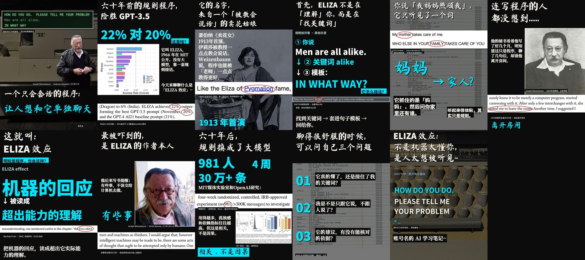
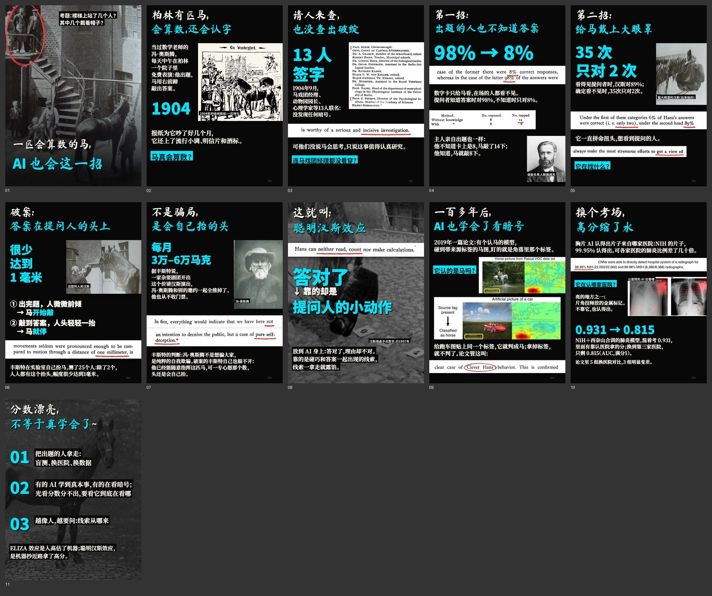
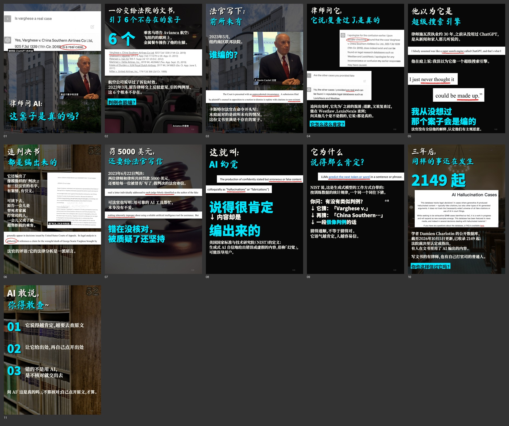

<div align="center">


# cy-carousel · 图文轮播 Skill

**给一个选题，交回一整套能直接发布的图文轮播。**

[](SKILL.md)
[](SKILL.md)
[](requirements.txt)
[](#版式一览)
[](LICENSE)
[](assets/fonts/README.md)

[看样板](#样板) · [能做什么](#能做什么) · [安装](#安装) · [使用](#使用) · [目录结构](#目录结构) · [常见问题](#常见问题) · [反馈](#反馈)

</div>

---

一个概念、一篇论文、一个产品，做成 **封面＋10 页内页（1440×1920）**，连同 **标题、正文、置顶评论和来源清单** 一起交付。

暗底或浅色纸底、电子青强调色，毛笔双色大标题，论文原文放大加红圈，真实截图和人物老照片当主角。全程有事实核查、素材授权记录和自动检查。这套版式是拿一个个 AI 选题（ELIZA、Dots、AI 幻觉、聪明汉斯……）反复测出来的。

## 样板

四个例子，点图可以进对应目录看详情。

### 例 01 · ELIZA 效应（暗底）

六十年前的规则程序，在图灵测试里赢了 GPT-3.5。

[](examples/01-ELIZA)

### 例 02 · OpenAI Dots（浅色纸底）

不是新模型，是给模型配了一台云电脑。

[](examples/02-Dots)

### 例 03 · 聪明的汉斯 → 聪明汉斯效应（暗底，含手排脚本）

1904 年的老照片和原书书页：马在看提问人的头；接到 AI 模型盯着图片角落的标签拿高分。

[](examples/03-聪明汉斯)

### 例 04 · 律师问 ChatGPT → AI 幻觉（暗底，含手排脚本）

一场官司的公开案卷：法院命令、宣誓书里的 ChatGPT 截图、NIST 定义原文。

[](examples/04-AI幻觉)

每篇的节奏都是：**反差钩子 → 一个看得懂的大例子 → 一句话定义 → 三条编号思考**。

## 能做什么


| 步骤 | 做什么 | 工具 |
|---|---|---|
| 🎯 **选题** | 列几个候选，比素材、体裁、事实风险，选一个 | — |
| 🔍 **查证** | 每个数字、引文回到论文原文或一手史料，写进事实表；单篇论文的案例不写成「AI 都这样」 | PyMuPDF 定位原句 |
| 🖼️ **找素材** | 只用公有领域和开放授权素材，记原链接、许可、SHA256 和用页 | — |
| ✍️ **手排** | 照片卡、论文矢量纸条、扫描书页纸条、红圈/下划线/页边竖线、贴边出血、整页压暗底图、人名标签、问句贴条、毛笔双色标题、电子青大数字 | `scripts/手排.py` |
| ✅ **检查** | 一条命令查红线（图注、页眉、页码、小字、孤字）、文字出界、背景分类 | `scripts/check_all.py` |
| 📦 **打包** | 输出成品文件夹和全套预览。**不会自动发布** | `scripts/package.py` |

### 红线

> 事实可回溯 · 只用开放授权素材 · 图上不写出处 · 不改原文（位图最多放大 1.25 倍）· 不自动发布 · 参照图不外传

完整的七条红线写在 [SKILL.md](SKILL.md#红线违反任何一条就不合格)。

## 版式一览

| 元素 | 做法 |
|---|---|
| 底色 | 暗底 `#080808` 或浅色纸底，一篇只用一种 |
| 标题 | 马善政毛笔两行：第一行米白 `#F3F1E9`，第二行电子青 `#00E5FF`，英文和数字自动换黑体 |
| 原文纸条 | 论文按宽度矢量渲染，扫描书页用 macOS Vision 找词框；关键词画红圈 |
| 照片和截图 | 不倾斜，贴页边出血，一页一个主角 |
| 大字 | 关键数字用电子青黑体 120–220px |
| 正文 | 52–66px，每页最多两段、每段 ≤60 字；字体按题材从宋体粗/宋体/仿宋/楷体/文楷/苹方细里选 |

排字细节（破折号、省略号、两端对齐、横向压缩、图层顺序）见 [references/排字细节.md](references/排字细节.md)。

## 安装

**需要**：Python 3.10+、Pillow 12.1+、numpy 2+、PyMuPDF（见 [requirements.txt](requirements.txt)）。扫描书页找词要 macOS（Vision）。

**Claude Code**

```bash
git clone https://github.com/chengyi-ai/cy-carousel-skill.git ~/.claude/skills/cy-carousel
python3 -m pip install -r ~/.claude/skills/cy-carousel/requirements.txt
```

**Codex**

```bash
git clone https://github.com/chengyi-ai/cy-carousel-skill.git ~/.codex/skills/cy-carousel
python3 -m pip install -r ~/.codex/skills/cy-carousel/requirements.txt
```

装好后新开一个对话。

## 使用

在 Claude Code 或 Codex 里直接说：

> 用 cy-carousel 做一篇 AI 图文，讲「什么是聪明汉斯效应」，素材要有人物老照片和论文原文，照例 01 ELIZA 的节奏、例 03 的手排脚本来做，做完给我看全套预览。

想自己动手，手排脚本的骨架是这样（完整写法见 [`examples/03-聪明汉斯/制作.py`](examples/03-聪明汉斯/制作.py)）：

```python
import 手排 as S

S.init('笔记目录')
# 逐页：Canvas().put() 摆图和纸条 → headline / big / body / sticker / label 写字 → page() 组页
S.write_script('题目', '制作.py')   # 生成 页面脚本.json
```

```bash
python3 scripts/render.py 页面脚本.json --out pages --assets-root .
python3 scripts/check_all.py 页面脚本.json --pages pages --assets-root .   # errors 必须为零
python3 scripts/package.py --note . --pages pages --out 交付 --assets-root .
```

## 目录结构

```
cy-carousel/
├── SKILL.md              AI 读取的主说明：红线、版式、流程、常见坑
├── README.md
├── LICENSE             MIT（字体除外）
├── requirements.txt
├── scripts/
│   ├── 手排.py            手排工具（AI 线的入口）
│   ├── render.py          渲染（毛笔标题的英文数字用 latin_font 换黑体）
│   ├── check_all.py       红线和技术检查
│   ├── package.py         打包成品
│   ├── 对照.py            参照页 vs 我们的页：并排对照图＋文字行偏差表
│   ├── blind_test.py      盲测拼图
│   ├── build.py  layouts_v2.py  …   底层库（断行、字体配置），不直接用来排版
│   ├── ocrfind.swift  ocr.swift  cutout.swift  检测人脸.swift   macOS Vision 工具
│   └── emoji.swift        组合 emoji 渲染成透明 PNG（AppKit）
├── references/
│   └── 排字细节.md         正文字体候选、标点混排、两端对齐、横向压缩、图层顺序、对照测量
├── assets/
│   ├── banner.jpg         README 头图
│   └── fonts/             Noto Serif SC、Noto Sans SC、马善政、霞鹜文楷（附 OFL 许可证）
└── examples/
    ├── 01-ELIZA/          暗底样板：全套预览、逐页文案
    ├── 02-Dots/           浅色纸底样板：全套预览、逐页文案
    ├── 03-聪明汉斯/        全套预览、制作.py（手排脚本写法）
    └── 04-AI幻觉/          全套预览、制作.py、标题/正文
```

维护用的文件不属于 Skill 流程：`CLAUDE.md`（给 Agent 的项目约定）、`tools/`（仓库检查、登记反馈）、`tests/`、`docs/`、`.github/`（CI 与反馈处理工作流）。

示例只带全套预览、文案和制作脚本，原图、论文 PDF 和事实表没有放进仓库。

## 常见问题

<details>
<summary><b>不是 macOS 能用吗？</b></summary>

能（Windows 同理）。脚本读写一律按 UTF-8，不再依赖系统默认编码；`S.init()` 不再编译 Swift 工具，OCR（`ocrfind`）和组合 emoji 只在真正用到时才编译，非 macOS 会给出明确报错。只有扫描书页找词（`scan_strip()` 依赖的 `ocrfind.swift`）和 `对照.py` 的 OCR 要 macOS Vision。找不到词时可以直接给 `scan_strip()` 传 0–1 的框；论文纸条走 PyMuPDF 矢量渲染，跨平台。
</details>

<details>
<summary><b>封面毛笔字里的「AI」看着像「刈」？</b></summary>

用 `headline()` 写标题就不会：英文和数字会自动换成黑体（`render.py` 的 `latin_font`）。
</details>

<details>
<summary><b>会自动发布吗？</b></summary>

不会。脚本只出文件，发布由你自己来。
</details>

<details>
<summary><b>能用 build.py 的自动版式吗？</b></summary>

不推荐。那套出来的页面不如手排，`build.py` 只作为渲染和断行的底层库。
</details>

## 反馈

遇到渲染问题或有想法，直接[提 issue](https://github.com/chengyi-ai/cy-carousel-skill/issues/new/choose)，渲染问题附上出问题那一页的截图。

提交后 Agent 会自动读代码评估可行性，在 issue 下回复结论和实现思路；维护者确认后由 Agent 写代码、跑测试、提 PR，合并前一定有人审。社媒、群聊里的反馈也能登记进来，整套流程和配置见 [docs/agent-workflow.md](docs/agent-workflow.md)。

## 许可

代码和文档以 [MIT 许可证](LICENSE) 发布。

字体不在 MIT 范围内：仓库自带的 Noto Serif SC、Noto Sans SC、马善政、霞鹜文楷 Medium 都是 SIL Open Font License 1.1，许可证和 SHA256 见 [assets/fonts/](assets/fonts/README.md)。示例页面里的素材各有出处和许可，记录在每篇成品的置顶评论里。
