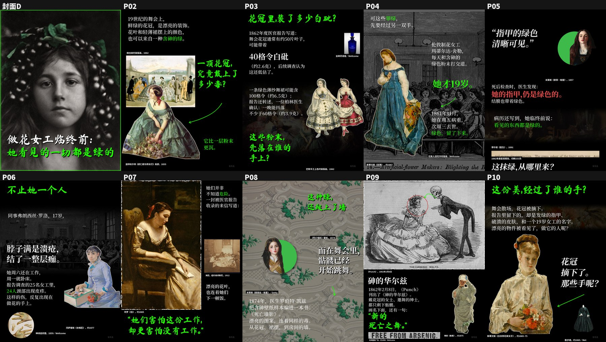
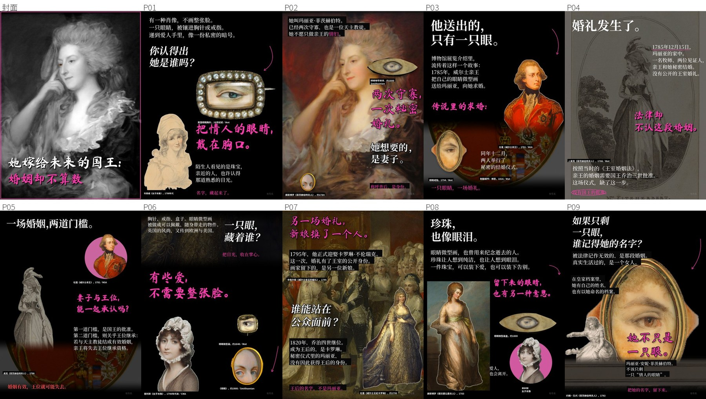

# lishi-tuwen · 历史图文轮播 Skill

给一个历史选题，按一套已经打磨好的版式，做出一篇能直接发小红书的图文笔记：**封面加 8–12 页内页（1440×1920）、标题、正文、话题标签、置顶评论和来源清单**，全程有事实核查、图片授权记录和自动检查。

适合的选题：历史人物、女性处境、服饰与器物背后的故事，比如有毒的绿色颜料、维多利亚时代的服饰规定、王室秘密婚姻。

可以在 **Claude Code** 和 **Codex** 里当 Skill 用，也可以直接用命令行跑脚本。


上图是用排版器一次排出的完整一篇（例 04）。更早的手工版：

| 砷绿假花（暗色） | 情人眼（暗色） | 泳衣量腿（浅色） |
|---|---|---|
|  |  |  |

## 这一版更新了什么

- **新增排版器 `scripts/build.py`**：作者只写 `内容.json`，也就是每页的文字和选图。标题、正文、强调句、图片的位置和字号都由 8 套固定版式决定，正文按语意自动断行，不拆人名，也不留孤字。之前让 AI 从零摆坐标，每次结果都不一样。
- **新增红线检查**：图注、页眉、页码、过小的字和孤字行会直接判为不合格。
- **新的文案方法**（`references/文案公式.md`）：每篇先写一句论点，再按八步骨架分到每一页，用事件证明这个论点，而不是按时间复述事件。排版器会检查缺论点、正文没有锚点、强调句像小结、结尾没有回扣开头、解说腔这几类问题。
- **底色文字**（`note`）：强调色逐行底条加黑字，放原话、关键数字或证据边界，每页最多 1 处、全篇不超过 5 处。
- **风格指标改成参考项**：色彩丰富度、强调色占比、留白配额这些指标只提醒，不再阻止交付。之前 AI 为了凑这些数字去改版式，反而把页面做坏了。

---

## 它能做什么

1. **选题与查证**：每个年份、人名、数字都回到原始档案、馆藏或同期报刊核对，写进事实表；流传但没有证据的说法标成「传说」，不给当事人编台词。
2. **文案**：给 3 个标题备选，每页正文都给下一页留钩子，再配 18–22 个话题标签、置顶评论和资料来源。
3. **找图与授权**：优先用公有领域和开放授权的图片，记下原链接、许可、文件 SHA256，以及每张图用在哪一页。
4. **排版与渲染**：
   - 色调：暗色和浅色两条路线，一篇只用一种；
   - 字体：毛笔大标题，彩色和白色大字交替；
   - 图片：人物抠图、圆盘肖像，只等比裁切不拉伸，裁切时保住人脸；
   - 背景：在黑底、压暗整图、亮图之间轮换；
   - 排版器：8 套固定版式，自动按语意断行、挑字号、匀间距，作者不用摆坐标。
5. **自动检查**：一条命令跑完红线（图注、页眉、页码、小字、孤字）、标点间距、字和脸有没有碰撞、图片比例等检查，给出 PASS/FAIL；色彩、留白这类风格指标只作参考。
6. **盲测**：把新页面和参考页面混在一起，随机编号，答案另存，用来检验「像不像」。
7. **打包**：输出和发布一致的成品文件夹（带标题的主封面、无字封面备选、内页、全套预览和全部文稿）。**脚本不会自动发布。**

---

## 安装

### 环境要求

- Python 3.10 及以上；
- Pillow 12.1+、numpy 2+；jieba 可选，装了以后断行更自然（见 `requirements.txt`）；
- **macOS**：抠图、OCR、人脸检测用的是系统自带的 Vision。其他系统可以手动提供抠图 mask 和人脸框，其余流程照常运行（见下文「限制」）。

### 装到 Claude Code

```bash
git clone https://github.com/chengyi-ai/lishi-tuwen-skill.git ~/.claude/skills/lishi-tuwen
python3 -m pip install -r ~/.claude/skills/lishi-tuwen/requirements.txt
```

### 装到 Codex

```bash
git clone https://github.com/chengyi-ai/lishi-tuwen-skill.git ~/.codex/skills/lishi-tuwen
python3 -m pip install -r ~/.codex/skills/lishi-tuwen/requirements.txt
```

装好以后**新开一个对话**，Skill 才会被识别。

### 更新

```bash
git -C ~/.claude/skills/lishi-tuwen pull
```

Codex 那份把路径换成 `~/.codex/skills/lishi-tuwen` 即可。

---

## 使用

### 方式一：直接跟 AI 说（推荐）

在 Claude Code 或 Codex 里说：

> 用 lishi-tuwen 做一篇历史图文，选题：维多利亚时代的砷绿墙纸，主强调色绿色，账号名填「XXX」。按 SKILL.md 的红线来，用 build.py 排版，做完给我看全套预览。

AI 会先查证、找图，再写 `内容.json`，最后用排版器出图。**如果 AI 自己写了网页、用了别的模板，或者图上出现图注、页眉、页码，就是没按 Skill 做**，让它回到 `build.py` 重排。

不点名 Skill 也行，比如「帮我做一篇关于 XX 的历史图文」，一般会自动触发。可以附带这些要求：

| 参数 | 说明 | 默认 |
|---|---|---|
| 色调 | `暗` 或 `浅`，一篇只用一种 | 暗 |
| 主强调色 | 例如绿色、粉色、深红 | 按选题 |
| 页数 | 封面加 8–12 页内页 | 10 |
| 账号名 | 写进水印和署名 | 不填时图里显示「账号名」占位 |

### 方式二：命令行

以下命令都在 Skill 目录里运行，`工作/新选题` 换成你自己的工作目录。

**1. 准备**：把图片放进 `工作/新选题/assets/`，照着 `assets/templates/内容模板.json` 写 `工作/新选题/内容.json`。可选的版式见 SKILL.md 的「版式库」，完整范例是 `examples/04-战舰发型/内容.json`。

**2. 排版**（输出 p01.png 到 pNN.png、全套预览、页面脚本和排版报告）

```bash
python3 scripts/build.py 工作/新选题/内容.json --out 工作/新选题/成品
```

只重排其中几页：`--pages 3,7`。排版器会提示「栏下方空太多」「正文太少」「没有人脸框」，按提示改文字后重排。

**3. 全部检查**：`errors` 是红线和技术问题，必须为零；`advisories` 是风格指标，只作参考。

```bash
python3 scripts/check_all.py 工作/新选题/成品/页面脚本.json --pages 工作/新选题/成品 --assets-root 工作/新选题
```

**4. 盲测**（参考图要自己准备，Skill 不带任何他人作品）

```bash
python3 scripts/blind_test.py --reference-dir 参考/内页 --candidate-dir 工作/新选题/成品 --kind inner --out 工作/新选题/盲测.jpg
```

**5. 打包成品**（会先重新检查一遍，目标目录不为空时拒绝覆盖）

```bash
python3 scripts/package.py --note 工作/新选题 --pages 工作/新选题/成品 --out 工作/新选题/交付 --assets-root 工作/新选题
```

成品目录结构：

```
交付/
  01-封面.png          带两行大标题的主封面
  02.png … 11.png      内页
  封面备选-无字版.png   可选，用 --cover-c 传入
  全套预览.jpg
  标题.txt  正文.txt  置顶评论.txt  来源.md
  交付清单.json
```

### macOS Vision 工具

```bash
swift scripts/cutout.swift 输入.jpg 输出透明.png
swift scripts/ocr.swift 图片目录 OCR结果.json
swift scripts/检测人脸.swift 人脸输入.json 人脸结果.json
```

---

## 目录结构

```
lishi-tuwen/
  SKILL.md                 AI 读取的主说明：流程、硬规则、入口
  README.md                本文件
  requirements.txt
  references/
    视觉规范.md             现行版式规则：暗色和浅色、字体、颜色交替、背景、抠图
    文案公式.md             标题、正文、话题标签、置顶评论的写法
    选题规律.md
    自检清单.md
    使用说明.md             各脚本的输入输出与失败行为
    用户偏好与否决记录.md     做过、被否掉的方案和原因（只用来理解规则的来历，不当规则执行）
  scripts/
    build.py               排版器：内容.json → 成品（推荐入口）
    new_note.py  render.py  check_all.py  blind_test.py  package.py
    验证*.py               各项检查：排版、留白、交替节奏、标题效果、整篇色调、圆盘肖像、混合背景等
    cutout.swift  ocr.swift  检测人脸.swift
    保脸裁切.py  图像等比.py  浅色排版.py  换标题字体重出.py
  assets/
    fonts/                 Noto Serif SC、Noto Sans SC、Ma Shan Zheng（附 OFL 许可证）
    fonts/licensed/        只有说明文件，商业字体由你自己合法接入
    templates/             内容模板.json（排版器用）、页面脚本模板、标题/正文/置顶评论/来源模板
  examples/
    04-战舰发型/           排版器加新文案方法做的标准样本：内容.json、文稿、素材清单、缩略预览
    05-钻石项链/           同上，第二个样本
    06-美人痣/             第三个样本，用了底色文字（note）
    01-砷绿假花/  02-情人眼/  03-泳衣量腿/
                           早期手工版：页面脚本、文稿、来源、素材清单、渲染基准、缩略预览
  验证报告.md               独立复现、三套成品检查、新选题试跑的结果
  验证/                    验证过程的机器记录
```

---

## 红线（摘要）

完整内容见 SKILL.md。

- 只用 `build.py` / `render.py` 出图，不自己写网页或套别的模板。
- 图上不写图注、出处、页眉、页码或页脚口号。
- 黑底，人物为主，每页至少一张看得清脸的当时人物图。现代风景照、地图只能当配角。
- 标题两行，每行不超过 8 字；正文 52–60px；强调句 84–108px。
- 每页正文 60–110 字，按语意断行，不留孤字。

## 底层渲染规则（摘要）

完整规则见 `references/视觉规范.md`。写 `内容.json` 时不需要关心这些，排版器已经处理好了。

- **色调**：一篇只用一种，暗色或浅色，不混用。
- **封面**：主封面固定是带两行大标题的版本，无字版只当备选。
- **标题字体**：
  - 彩色大字用 Ma Shan Zheng 清晰版：1px 加粗、7 层斜向挤出、柔和投影；
  - 白色大字用 Noto Serif SC 700；
  - 毛笔字里不写阿拉伯数字。
- **颜色交替**：
  - 大字按「强调色、白色」交替，相邻两块不同色；
  - 页面上方三分之一和下方三分之一都要有强调色；
  - 强调色面积每页 0–3%。
- **图片**：
  - 只等比缩放，3:4 裁切铺满，保住人脸，不拉伸、不留填充边；
  - 同一张源图最多出现 2 次；
  - 封面主图在内页再出现时，必须换一个明显不同的裁切。
- **图层**：文字永远在图片上层；文字压到人物超过 3% 就报错。
- **浅色篇**：纸张底，矩形照片带投影，人名用黑色标签，红色手绘圈每页最多 2 个，空白纸面不超过 38%。

---

## 限制与注意事项

- **抠图、OCR、人脸检测只能在 macOS 上自动完成**。其他系统需要提供人工确认的人脸框和抠图 mask；检测失败时会报错，不会当成「没有人脸」处理。
- **不自带任何他人作品**：Skill 里只有自己写的规则拆解和自有成品；盲测用的参考图要自己准备。
- **示例只带缩略图**：示例的原始图片没有打包，素材清单里有每张图的来源和 SHA256。要完整重现示例，需要按清单取得原图，再用 `--assets-root` 指定素材目录。
- **事实和授权最终要人工确认**：检查脚本只验证技术指标，代替不了事实核查和视觉验收。
- **商业字体**：华康等商业字体不随包提供。拿到正式授权后，按 `assets/fonts/licensed/README.md` 接入；不要用第三方「免费下载」的字体文件。

---

## 许可

- **字体**：Noto Serif SC、Noto Sans SC、Ma Shan Zheng 都采用 SIL Open Font License 1.1，许可证在 `assets/fonts/` 下，可以随 Skill 再分发。
- **示例图片**：以各示例 `来源.md` 和 `素材清单.json` 里记录的原始许可为准（公有领域或开放授权）。
- **代码与文稿**：作者保留所有权利。本仓库为私有仓库，仅供受邀者使用，未经许可请勿公开再分发。
