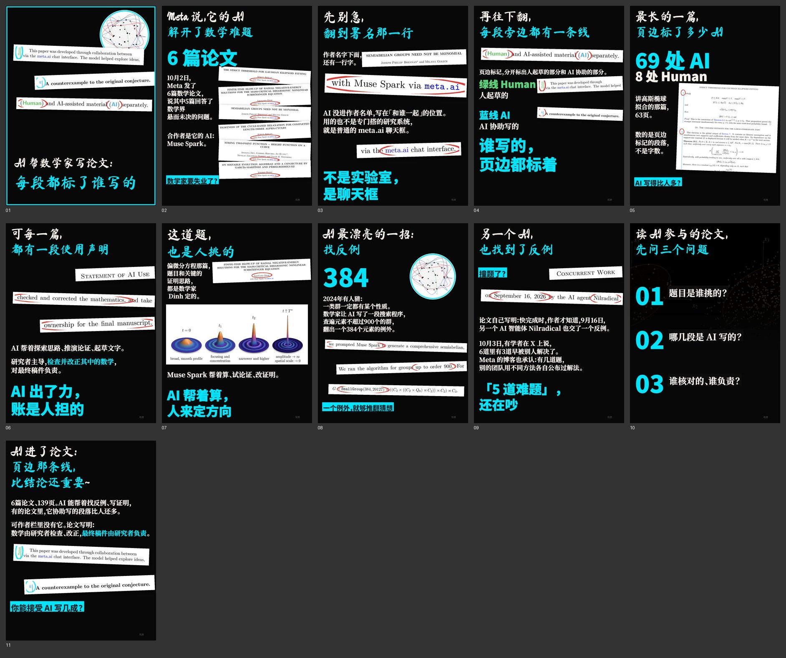

# 例 02｜Meta 的 AI 帮数学家写论文：页边标着谁写的（AI 科技线）

2026 年 10 月 Meta 发了 6 篇数学论文，说其中 5 篇回答了悬而未决的问题；翻开论文，每段页边都标着是人起草还是 AI 协助。暗底、电子青强调色，ELIZA 式手排。

- 素材以论文原文为主：署名行「with Muse Spark via meta.ai」、页边 Human / AI 标记、使用声明、反例 SmallGroup(384, 20127) 等，都从 PDF 矢量渲染成纸条，关键词画红圈。
- 做法：`制作v2.py` 是 `scripts/手排.py` 的前身（函数写在脚本里），思路相同。
- 第一版用历史线的 `build.py` 自动排，被评「不如之前做的」；改成这种手排后才达到 AI 线的标准。别用 build.py 的自动版式排 AI 选题。
- 论文 PDF 未随包提供，出处见成品置顶评论。
