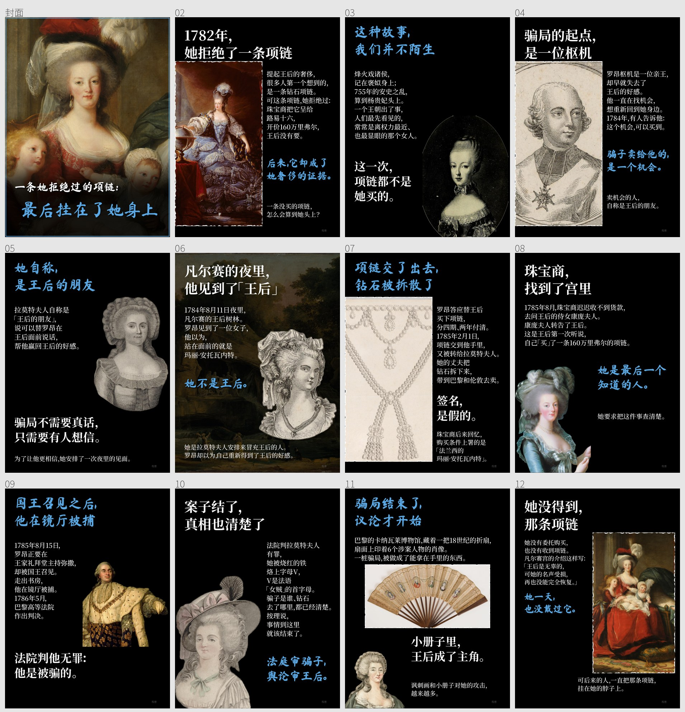

# 例 05｜钻石项链：一条她拒绝过的项链，最后挂在了她身上

用排版器和新文案方法做的第二个样本。重点看文案怎么围绕一句论点展开。

## 论点

一条王后拒绝过、从没戴过的项链，最后成了她奢侈的证据：法庭审的是骗子，舆论审的是她。

## 八步怎么分到 11 页

| 页 | 这一步 | 这页的强调句 |
|---|---|---|
| 封面 | 打破印象 | 一条她拒绝过的项链：最后挂在了她身上 |
| P1 | 打破印象 | 后来，它却成了她奢侈的证据。 |
| P2 | 参照物（褒姒、杨贵妃） | 这一次，项链都不是她买的。 |
| P3–P6 | 场景和证据 | 骗子卖给他的，是一个机会。／她不是王后。／签名，是假的。 |
| P7–P8 | 解释机制 | 她是最后一个知道的人。／法院判他无罪：他是被骗的。 |
| P9 | 转折 | 法庭审骗子，舆论审王后。 |
| P10 | 再推一层 | 小册子里，王后成了主角。 |
| P11 | 回扣收尾 | 她一天，也没戴过它。（回扣封面「挂在了她身上」） |

## 事实依据

- 凡尔赛宫「钻石项链事件（1784–1785）」介绍：
  - 1782 年呈给路易十六，王后拒绝；
  - 160 万里弗尔，分四期、两年付清；
  - 1784 年 8 月 11 日，王后树林；
  - 1785 年 8 月 15 日，罗昂在镜厅被捕；
  - 拉莫特夫人被烙上字母 V；
  - 王后「名声受损，再也没能完全恢复」。
- 1786 年珠宝商备忘录英译（乔治梅森大学史料项目，文献 263）：购买条件上的署名。
- 英国博物馆人物资料：拉莫特伯爵到伦敦出售钻石。
- 不写钻石颗数；不把任何现代珠宝说成原项链。

## 图片

全部为公有领域或 CC0：
- 法国国家图书馆《项链案人物肖像组》、各幅拉莫特夫人版画；
- 大都会艺术博物馆项链图样 49.40.324；
- 凡尔赛宫藏戈蒂耶-达戈蒂、维热-勒布伦的王后肖像，杜普莱西的路易十六像；
- 巴黎卡纳瓦莱博物馆折扇 EV0120、于贝尔·罗贝尔的园林画。

原图没有随包提供，`素材清单.json` 记录了文件名和 SHA256。
