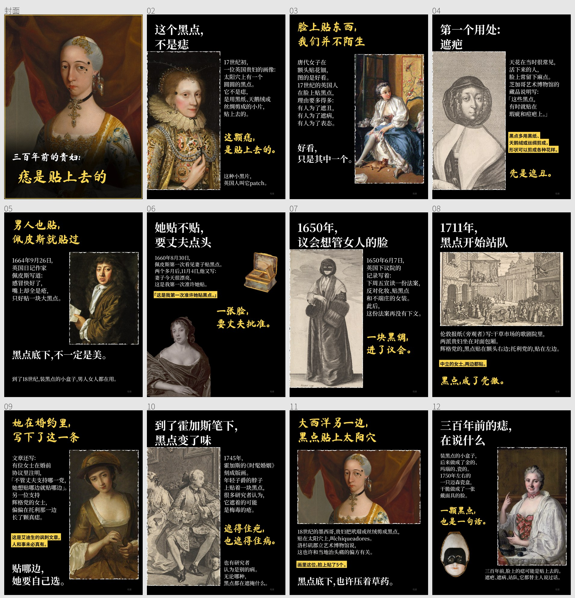

# 例 06｜痣是贴上去的（17–18 世纪的 patch）

用排版器和新文案方法做的第三个样本，也是第一个用「底色文字」（`note`）的样本：黄底黑字，用来放原话、关键数字和证据边界。

- 论点：人们以为美人痣是长出来的；三百多年前，它是一块贴上去的黑绸，能遮疤、遮病，还被拿来站队。
- 底色文字 5 处：
  - 黑点用什么做的；
  - 佩皮斯日记原话；
  - 「中立的女士两边都贴」；
  - 「这是讽刺文章，人和事未必真有」；
  - 「画里这位贴了 5 个」。
- 事实依据：
  - Pepys Diary（1660-08-30、1660-11-04、1664-09-26）；
  - House of Commons Journal（1650-06-07）；
  - The Spectator No. 81（1711-06-02）；
  - 芝加哥艺术博物馆 Patch Box 说明；
  - LACMA Unframed（2018）。
- 图片：大都会艺术博物馆 CC0 藏品，以及 Wikimedia Commons 上的公有领域画作。原图未随包提供。
