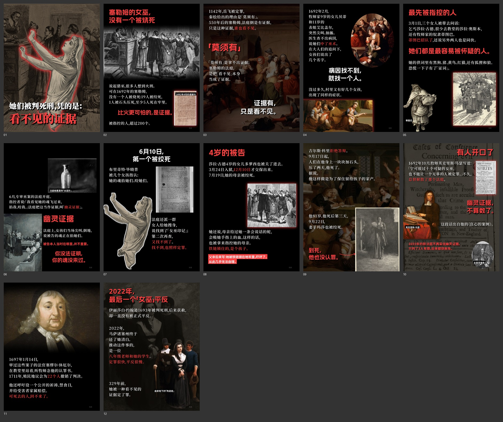

# 例 07｜塞勒姆女巫：看不见的证据（1692）

v2 原版风样本，红色强调色。惊悚题材也照样「用事件证明论点」：人们以为女巫是被烧死的；1692 年的塞勒姆没有一个人被烧死，判她们死刑的，是一种谁也看不见的证据。

- 版式：宽幅、渐隐（整页压暗的油画和版画）、圆像、错落（死刑令、《良心案例》书影 + 人物抠图）、立像。
- 人物抠图：从 1892 年石版画《The Witch No. 1》里抠出受审女子（先裁出人物所在区域再抠）；马瑟、休厄尔、诺布尔《塞勒姆殉道者》都是整幅抠图。
- 原图分辨率低的派尔插画，改用贴边照片，不硬放大。
- 不写的内容：莎拉·古德的诅咒、科里的「再加点重量」（没有当时记录）；被告没有留下画像，图都是 19 世纪画家的想象，在置顶评论里说明。
- 图片：Wikimedia Commons / 美国国会图书馆的公有领域图像。原图未随包提供。
