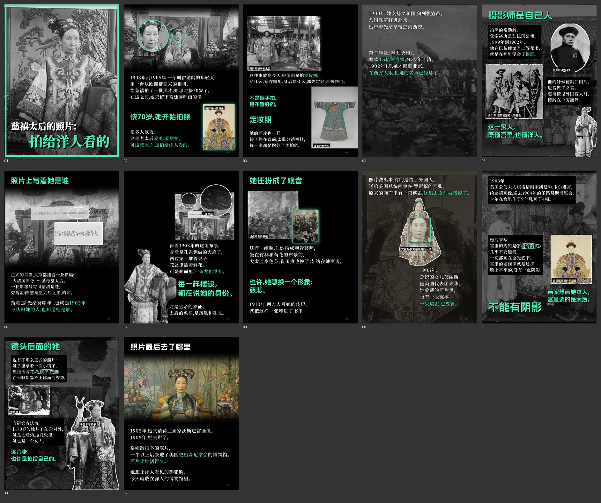

# 例 08｜慈禧的照片（1903–1905）

v2 原版风样本，青绿强调色。素材是裕勋龄拍的玻璃底片（弗利尔美术馆档案，公有领域），混进了 4 张彩色图（宫廷画师的朝服像、大都会藏清末女吉服、沃斯的油画像），打破整篇灰色。

- 论点：人们以为慈禧拍照是老太后爱美；其实那是庚子之后的一场形象公关，照片是拍给洋人看的。
- 局部放大 6 处（脸、横幅题字、孔雀翎扇、镜子等），用 `zoom` 字段。
- P5、P10、P11 是手工排的页：`手排页.py` 手写坐标，生成 `内容-手排.json`，版式 `手排`。整页压暗的照片当底、黑色方块放正文、白边抠图、椭圆头像、撕边照片、手绘圈。
- 字体：内页标题阿里妈妈数黑体，封面思源宋体 Black，都加黑色立体投影。`内容.json` 里的 `title_font` 指向 `fonts/AlimamaShuHeiTi-Bold.ttf`：字库请自己从官方 fonts.alibabagroup.com 下载（免费商用，但授权不允许单独转发，所以不随 Skill 提供）。没有这个文件时，把 `title_font` 删掉，会退回思源黑体。
- 盲测（Codex）：单页四格测试（她的 3 张 + 我们 1 张）里，自动排和手排都在瞎猜水平；整篇 4 选 1 仍有约 3/4 被认出。
- 原图未随包提供，出处见成品的置顶评论和来源。
